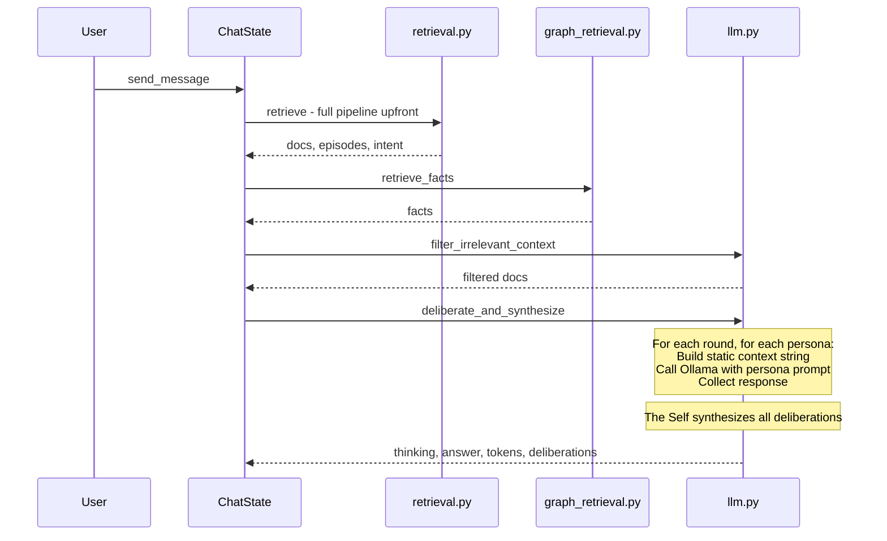
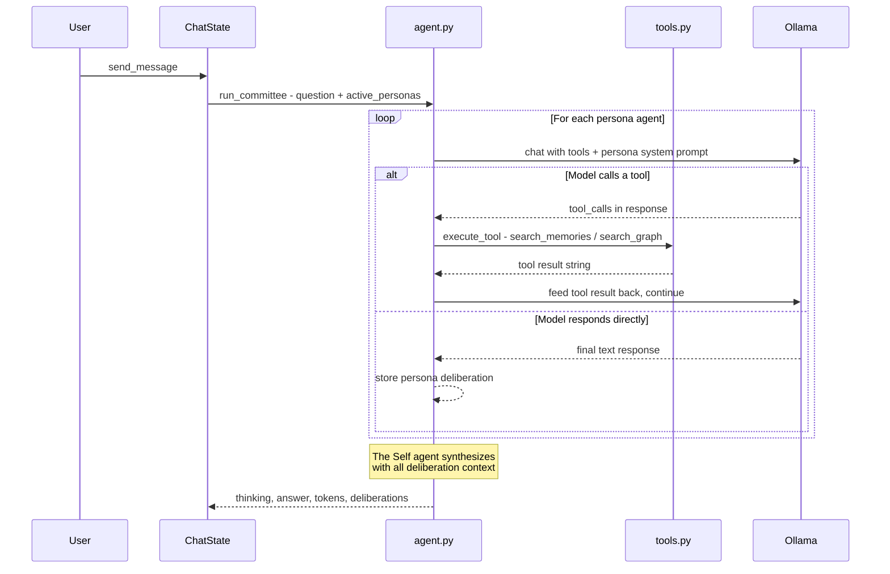

# Agent Loop Architecture — Tool-Calling Persona Agents

## Overview

Convert the sequential committee deliberation system into an **autonomous agent loop** where each IFS persona is an agent that can decide when and how to query memory tools (ChromaDB, Neo4j). Uses **native Ollama tool-calling API** — no LangChain dependency.

## Current vs. Target Architecture

### Current Flow (Sequential)



### Target Flow (Agent Loop)



## Key Design Decisions

1. **No upfront retrieval** — The current flow calls `retrieve()` and `retrieve_facts()` before any persona sees the question. In the agent loop, each persona **decides for itself** whether to search memories. This means:
   - Some personas may not need context at all (e.g., The Inner Child responding emotionally)
   - Different personas may search for different things
   - The intent analysis moves inside the tools

2. **Tools are thin wrappers** — `rag/tools.py` wraps existing `retrieve()` and `retrieve_facts()` functions with JSON Schema definitions that Ollama understands.

3. **Scratchpad = message history** — Each agent iteration appends tool calls and results to the message list. The model sees its full reasoning trace. `max_iterations` caps the loop to prevent runaway tool-calling.

4. **Context purification stays** — `filter_irrelevant_context()` is called inside the `search_memories` tool, not at the top level. Each persona gets purified results.

5. **The Self remains the synthesizer** — After all persona agents finish, The Self gets their deliberations as context and produces the final answer. The Self can also call tools if needed.

6. **Backward compatible** — `call_llm()` for non-committee mode is untouched. The agent loop only activates when `active_personas` is non-empty.

## File Changes

### New Files

#### `rag/tools.py` — Tool Definitions and Executor

```python
"""
rag/tools.py — Memory tools for persona agents.

Defines tool schemas (JSON Schema for Ollama) and executor functions
that wrap existing retrieval pipelines.
"""

# ── Tool JSON Schemas (Ollama format) ──────────

TOOL_SCHEMAS = [
    {
        "type": "function",
        "function": {
            "name": "search_memories",
            "description": (
                "Search conversation logs and episodic memories. "
                "Use this when you need to recall specific conversations, "
                "events, or experiences from the past."
            ),
            "parameters": {
                "type": "object",
                "properties": {
                    "query": {
                        "type": "string",
                        "description": "Natural language search query"
                    }
                },
                "required": ["query"]
            }
        }
    },
    {
        "type": "function",
        "function": {
            "name": "search_knowledge_graph",
            "description": (
                "Search the knowledge graph for facts about people, "
                "places, and relationships. Use this when you need to "
                "know about specific people or locations."
            ),
            "parameters": {
                "type": "object",
                "properties": {
                    "people": {
                        "type": "array",
                        "items": {"type": "string"},
                        "description": "Names of people to look up"
                    },
                    "locations": {
                        "type": "array",
                        "items": {"type": "string"},
                        "description": "Names of locations to look up"
                    }
                },
                "required": []
            }
        }
    }
]

# ── Tool Executor ──────────────────────────────

class ToolExecutor:
    """Executes tool calls using existing retrieval infrastructure."""

    def __init__(self, collection, episodic, id_to_name, name_to_id,
                 intent_model, ollama_host, n_results, top_k,
                 do_rerank, hybrid):
        self.collection = collection
        self.episodic = episodic
        self.id_to_name = id_to_name
        self.name_to_id = name_to_id
        self.intent_model = intent_model
        self.ollama_host = ollama_host
        self.n_results = n_results
        self.top_k = top_k
        self.do_rerank = do_rerank
        self.hybrid = hybrid

    def execute(self, tool_name: str, arguments: dict) -> str:
        """Dispatch a tool call and return a string result."""
        if tool_name == "search_memories":
            return self._search_memories(arguments.get("query", ""))
        elif tool_name == "search_knowledge_graph":
            return self._search_graph(
                arguments.get("people", []),
                arguments.get("locations", [])
            )
        return f"Unknown tool: {tool_name}"

    def _search_memories(self, query: str) -> str:
        from rag.retrieval import retrieve
        docs, episodes, intent = retrieve(
            query, self.n_results, self.collection, self.episodic,
            self.id_to_name, self.name_to_id,
            self.intent_model, self.ollama_host,
            top_k=self.top_k, do_rerank=self.do_rerank,
            hybrid=self.hybrid,
        )
        # Format results as readable text
        parts = []
        if docs:
            parts.append("=== CONVERSATION LOGS ===")
            for d in docs:
                parts.append(f"[{d['date']}] [Chat: {d['friend']}]\n{d['content']}")
        if episodes:
            parts.append("=== EPISODIC MEMORIES ===")
            for e in episodes:
                parts.append(f"[{e['date']}] {e['content']}")
        return "\n\n".join(parts) if parts else "No relevant memories found."

    def _search_graph(self, people: list, locations: list) -> str:
        from rag.graph_retrieval import retrieve_facts
        intent = {"people": people, "locations": locations}
        facts = retrieve_facts(intent)
        if facts:
            return "=== KNOWLEDGE GRAPH FACTS ===\n" + "\n".join(f"- {f}" for f in facts)
        return "No facts found in the knowledge graph."
```

#### `rag/agent.py` — Agent Loop Engine

```python
"""
rag/agent.py — Autonomous agent loop using Ollama native tool-calling.

Each persona becomes an agent that can call memory tools.
The Self synthesizes all persona deliberations into a final answer.
"""
import ollama
from config import IDENTITIES
from rag.tools import TOOL_SCHEMAS, ToolExecutor

MAX_TOOL_ITERATIONS = 3  # Per-persona cap on tool-calling rounds

def _run_persona_agent(
    persona: str,
    question: str,
    client: ollama.Client,
    model: str,
    num_ctx: int,
    tool_executor: ToolExecutor,
    previous_deliberations: list[dict],
    enable_thinking: bool = True,
    max_iterations: int = MAX_TOOL_ITERATIONS,
) -> dict:
    """
    Run a single persona as a tool-calling agent.
    Returns {"persona", "response", "tool_trace", "prompt_tokens", "completion_tokens"}
    """
    persona_prompt = IDENTITIES[persona]

    # Build system prompt with committee instructions
    delib_ctx = ""
    if previous_deliberations:
        delib_ctx = "\n\n=== PREVIOUS DELIBERATIONS ===\n"
        for d in previous_deliberations:
            delib_ctx += f"[{d['persona']}]: {d['response']}\n\n"

    system_prompt = (
        f"{persona_prompt}\n\n"
        "You are participating in an inner committee deliberation. "
        "You have access to memory tools — use them if you need to recall "
        "specific facts, conversations, or experiences to inform your perspective. "
        "If the question is emotional or philosophical, you may respond directly "
        "without searching.\n\n"
        "RELATIONSHIP INTERPRETATION GUIDE:\n"
        "- 'WAS' or '(PAST relationship)' = HISTORICAL, no longer true\n"
        "- 'IS' or '(CURRENT relationship)' = TRUE RIGHT NOW\n"
        f"{delib_ctx}"
    )

    messages = [
        {"role": "system", "content": system_prompt},
        {"role": "user", "content": question},
    ]

    tool_trace = []  # Track tool calls for UI display
    total_p_tok, total_c_tok = 0, 0

    for iteration in range(max_iterations):
        chat_kwargs = {
            "model": model,
            "messages": messages,
            "tools": TOOL_SCHEMAS,
            "stream": False,
            "options": {"num_ctx": num_ctx},
        }
        if enable_thinking:
            chat_kwargs["think"] = True

        resp = client.chat(**chat_kwargs)
        msg = resp["message"]
        total_p_tok += resp.get("prompt_eval_count", 0)
        total_c_tok += resp.get("eval_count", 0)

        # Check for tool calls
        tool_calls = msg.get("tool_calls", [])
        if not tool_calls:
            # Model is done — extract final response
            break

        # Execute each tool call
        messages.append(msg)  # Add assistant message with tool_calls
        for tc in tool_calls:
            fn = tc["function"]
            tool_name = fn["name"]
            tool_args = fn["arguments"]
            result = tool_executor.execute(tool_name, tool_args)

            tool_trace.append({
                "tool": tool_name,
                "args": tool_args,
                "result_preview": result[:200] + "..." if len(result) > 200 else result,
            })

            messages.append({
                "role": "tool",
                "content": result,
            })

    # Parse final response
    content = msg.get("content", "")
    thinking = msg.get("thinking", "")

    return {
        "persona": persona,
        "response": content,
        "thinking": thinking,
        "tool_trace": tool_trace,
        "prompt_tokens": total_p_tok,
        "completion_tokens": total_c_tok,
    }


def run_committee(
    question: str,
    active_personas: list[str],
    model: str,
    ollama_host: str,
    num_ctx: int,
    tool_executor: ToolExecutor,
    deliberation_rounds: int = 1,
    enable_thinking: bool = True,
    update_callback=None,
) -> tuple:
    """
    Orchestrate the full committee: persona agents deliberate, then The Self synthesizes.
    Returns (thinking, answer, prompt_tokens, completion_tokens, deliberations)
    """
    client = ollama.Client(host=ollama_host)
    deliberations = []
    total_p_tok, total_c_tok = 0, 0

    # 1. Run each persona agent
    for r in range(1, deliberation_rounds + 1):
        for persona in active_personas:
            if persona not in IDENTITIES:
                continue

            if update_callback:
                update_callback(persona, r, "working", None)

            result = _run_persona_agent(
                persona=persona,
                question=question,
                client=client,
                model=model,
                num_ctx=num_ctx,
                tool_executor=tool_executor,
                previous_deliberations=deliberations,
                enable_thinking=enable_thinking,
            )

            total_p_tok += result["prompt_tokens"]
            total_c_tok += result["completion_tokens"]

            delib_entry = {
                "persona": persona,
                "round": r,
                "response": result["response"],
                "tool_trace": result["tool_trace"],
            }
            deliberations.append(delib_entry)

            if update_callback:
                update_callback(persona, r, "done", result["response"])

    # 2. The Self synthesizes
    self_prompt = IDENTITIES.get("The Self", "You are the balanced core Self.")
    delib_summary = "\n\n=== INNER COMMITTEE DELIBERATION ===\n"
    for d in deliberations:
        delib_summary += f"[{d['persona']} - Round {d['round']}]: {d['response']}\n\n"

    # The Self also gets tools in case it needs to verify facts
    self_result = _run_persona_agent(
        persona="The Self",
        question=question,
        client=client,
        model=model,
        num_ctx=num_ctx,
        tool_executor=tool_executor,
        previous_deliberations=deliberations,
        enable_thinking=enable_thinking,
    )

    total_p_tok += self_result["prompt_tokens"]
    total_c_tok += self_result["completion_tokens"]

    return (
        self_result["thinking"],
        self_result["response"],
        total_p_tok,
        total_c_tok,
        deliberations,
    )
```

### Modified Files

#### `rag/llm.py` — Keep existing functions, add thin wrapper

- Keep `call_llm()`, `_safe_chat()`, `_parse_llm_response()`, `_build_context_string()`, `filter_irrelevant_context()` unchanged
- **Replace** `deliberate_and_synthesize()` with a wrapper that delegates to `rag.agent.run_committee()`
- Old signature preserved for backward compatibility

#### `virtual_me/state/chat_state.py` — Updated `send_message()`

Key changes:
- Remove upfront `retrieve()` and `retrieve_facts()` calls when in committee mode (agents do their own retrieval)
- Create `ToolExecutor` with the services/settings
- Call `run_committee()` instead of `deliberate_and_synthesize()`
- Non-committee mode (`call_llm`) still does upfront retrieval as before

#### `virtual_me/pages/chat.py` — Enhanced deliberation display

- Update `_deliberation_item()` to show tool traces (which tools were called, what was searched)
- Add tool call badges/icons in the deliberation accordion

## Data Flow Comparison

### Before: All context pre-loaded

```
User Question
    │
    ├── retrieve() ──────────── docs, episodes, intent
    ├── retrieve_facts() ────── facts
    ├── filter_irrelevant() ─── filtered docs
    │
    └── For each persona:
            Build context string from ALL docs/episodes/facts
            Call Ollama with static context
            Collect response
```

### After: Each agent searches autonomously

```
User Question
    │
    └── For each persona agent:
            Ollama sees question + persona prompt + tool definitions
            │
            ├── Agent decides: "I need to search memories"
            │   └── Calls search_memories tool → gets results
            │
            ├── Agent decides: "I need graph facts about Alice"
            │   └── Calls search_knowledge_graph tool → gets facts
            │
            └── Agent responds with its perspective
                (informed by whatever it chose to retrieve)
```

## Settings Impact

| Setting | Before | After |
|---------|--------|-------|
| `n_results` | Used in upfront retrieve() | Passed to ToolExecutor, used when agent calls search_memories |
| `top_k` | Used in upfront retrieve() | Same — inside ToolExecutor |
| `do_rerank` | Used in upfront retrieve() | Same — inside ToolExecutor |
| `hybrid` | Used in upfront retrieve() | Same — inside ToolExecutor |
| `deliberation_rounds` | Outer loop count | Same — controls how many rounds agents deliberate |
| `active_personas` | Which personas to loop over | Same — which persona agents to run |
| `enable_thinking` | Passed to Ollama | Same — passed to each agent call |
| `num_ctx` | Passed to Ollama | Same — passed to each agent call |

## Risk Mitigation

1. **Model tool-calling support** — Not all Ollama models support tool-calling. If a model returns an error, fall back to the current static-context approach. The `_safe_chat` pattern already handles this.

2. **Token explosion** — Each tool call adds tokens to the message history. `MAX_TOOL_ITERATIONS = 3` caps this. The `num_ctx` setting already limits context window.

3. **Slower responses** — More LLM calls per persona (tool call + final response vs. just final response). Mitigated by the fact that agents may choose NOT to call tools for simple/emotional questions.

4. **Non-committee mode unchanged** — `call_llm()` path is completely untouched. Only the committee/deliberation path changes.
