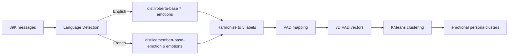

# Emotion → VAD Clustering Plan

## Problem

The current persona clustering pipeline uses **semantic embeddings** (BAAI/bge-m3, 1024d) which produce **topic clusters** (e.g., "travel", "food", "work"). The user wants **emotional clusters** instead — groups based on how messages *feel*, not what they're *about*.

## Solution: Dual-Model Emotion → VAD Approach

Use **language-specific emotion classifiers** (one for English, one for French), harmonize their outputs to a common 5-label set, then map to 3D **Valence-Arousal-Dominance** coordinates. Cluster in VAD space.



## Step 1: Language Detection

**Library**: `langdetect` — lightweight, fast, no model download needed.

```python
from langdetect import detect

def _detect_language(text: str) -> str:
    try:
        lang = detect(text)
        return "fr" if lang == "fr" else "en"  # default to English for non-French
    except:
        return "en"
```

- Applied once per message during `classify_emotions()`
- Messages are split into two batches: French and English
- Each batch goes through its respective model
- Results are merged back in original order

**Dependency**: Add `langdetect` to `requirements.txt`.

## Step 2: Emotion Classification

### English Model: `j-hartmann/emotion-english-distilroberta-base`

- **7 labels**: anger, disgust, fear, joy, neutral, sadness, surprise
- **Size**: ~82M params (DistilRoBERTa) — very fast
- **Built-in neutral** — no heuristic needed for English

### French Model: `cmarkea/distilcamembert-base-emotion`

- **6 labels**: joy, sadness, anger, fear, surprise, disgust (Ekman basic emotions)
- **Size**: ~66M params (DistilCamemBERT) — very fast, French-native
- **No neutral class** — needs heuristic: if `max(probs) < neutral_threshold`, inject neutral

### Alternative French Models (if results unsatisfactory)

| Model | Labels | Base | Notes |
|-------|--------|------|-------|
| `MilaNLProc/xlm-emo-t` | 4: anger, fear, joy, sadness | XLM-R ~278M | Multilingual, well-validated |
| `botmusic/French-Emotion-Classification` | 6: Ekman emotions | CamemBERT | Alternative CamemBERT-based |
| `Katsiaryna/french_emotion_detection` | 6 emotions | Unknown | Less documented |

### Label Harmonization → Common 5 Labels

Both models map to: **anger, fear, joy, sadness, neutral**

| English Model Output | → Common Label |
|---------------------|----------------|
| anger               | anger          |
| disgust             | anger (folded) |
| fear                | fear           |
| joy                 | joy            |
| neutral             | neutral        |
| sadness             | sadness        |
| surprise            | joy (folded)   |

| French Model Output | → Common Label |
|---------------------|----------------|
| anger / colère      | anger          |
| disgust / dégoût    | anger (folded) |
| fear / peur         | fear           |
| joy / joie          | joy            |
| sadness / tristesse | sadness        |
| surprise            | joy (folded)   |
| (heuristic)         | neutral        |

**Folding logic** (same for both models):
- `anger += disgust` — disgust is a variant of anger in VAD space
- `joy += surprise` — surprise is typically positive-valence in casual messaging
- Then renormalize so probabilities sum to 1.0
- For French: if `max(probs) < neutral_threshold`, inject neutral probability

## Step 3: VAD Mapping

Each of the 5 common emotions maps to a point in 3D VAD space (Russell circumplex + Warriner norms):

| Emotion  | Valence | Arousal | Dominance | Interpretation                         |
|----------|---------|---------|-----------|----------------------------------------|
| Joy      | 0.85    | 0.65    | 0.70      | Positive, moderately active, in control |
| Anger    | 0.15    | 0.85    | 0.75      | Negative, very active, dominant         |
| Fear     | 0.10    | 0.80    | 0.20      | Negative, very active, submissive       |
| Sadness  | 0.15    | 0.25    | 0.20      | Negative, passive, submissive           |
| Neutral  | 0.50    | 0.30    | 0.50      | Centered, calm, balanced                |

**Formula**: `VAD_vector = sum of p_i * VAD_i` for each emotion i, where probabilities sum to 1.0.

This produces a continuous 3D vector per message.

## Files to Modify

### 1. `tools/persona_clustering.py` — Add new functions

#### `detect_languages()`
```python
def detect_languages(texts: list[str]) -> list[str]:
    """Detect language for each text. Returns list of 'en' or 'fr'."""
```

#### `classify_emotions()`
```python
def classify_emotions(
    texts: list[str],
    batch_size: int = 64,
    neutral_threshold: float = 0.4,
    progress_callback=None,
) -> tuple[list[dict[str, float]], list[str]]:
    """
    Classify emotions using language-specific models.
    
    1. Detect language per message
    2. Batch English messages → distilroberta (7 emotions → 5 harmonized)
    3. Batch French messages → distilcamembert (6 emotions + neutral → 5)
    4. Merge results in original order
    
    Returns:
        (emotion_probs, languages)
        emotion_probs: list of dicts with keys: anger, fear, joy, sadness, neutral
        languages: list of 'en' or 'fr' per message
    """
```

#### `_harmonize_english()`
```python
def _harmonize_english(raw_probs: dict[str, float]) -> dict[str, float]:
    """Fold disgust→anger, surprise→joy, keep neutral. Renormalize."""
```

#### `_harmonize_french()`
```python
def _harmonize_french(raw_probs: dict[str, float], neutral_threshold: float) -> dict[str, float]:
    """Fold disgust→anger, surprise→joy, add neutral heuristic. Renormalize."""
```

#### `emotions_to_vad()`
```python
def emotions_to_vad(emotion_probs: list[dict[str, float]]) -> np.ndarray:
    """Map emotion probability dicts to 3D VAD vectors. Returns (n, 3) array."""
```

### 2. `ui/personas.py` — Update pipeline flow

#### Replace `_run_embed()` with `_run_classify()`
- Step 1: Load messages (unchanged)
- Step 2: Classify emotions (replaces embedding)
- Step 3: Map to VAD vectors
- Store in `st.session_state`:
  - `persona_emotion_probs` — list of dicts per message
  - `persona_languages` — list of 'en'/'fr' per message
  - `persona_vad_vectors` — np.ndarray shape (n, 3)
  - `persona_embeddings` → points to VAD vectors for downstream compat
  - `persona_lang_stats` — dict with counts per language

#### Add emotion distribution chart
- After classification: bar chart of average emotion probabilities
- Language split stats: "X English, Y French"

#### Add 3D VAD scatter plot
- `plotly.express.scatter_3d` with V, A, D axes
- Color by cluster label after clustering
- Interactive rotation/zoom

#### Update cluster overview
- Per-cluster: average V, A, D and dominant emotion
- Color-code by dominant emotion

#### Update cluster exploration
- Each sample message shows emotion label + VAD coords
- Color badge for dominant emotion

### 3. `requirements.txt` — Add dependency
- Add `langdetect` for language detection
- `transformers` already available via `sentence-transformers`
- `plotly` already listed

## Backward Compatibility

- Keep `embed_messages()` function intact
- Add a mode toggle in UI: **Emotion - VAD** vs **Semantic - Embedding**
- Default to Emotion mode
- `find_optimal_k()` and `cluster_embeddings()` work on any `np.ndarray` — no changes needed

## Expected Cluster Outcomes

With VAD-based clustering, expected clusters:
- **Joyful/Enthusiastic** — high V, moderate-high A, high D
- **Angry/Frustrated** — low V, high A, high D
- **Anxious/Worried** — low V, high A, low D
- **Sad/Melancholic** — low V, low A, low D
- **Calm/Neutral** — mid V, low A, mid D
- **Playful/Teasing** — high V, high A, moderate D

## Performance

- Language detection: ~89K messages with `langdetect` — fast, seconds
- English classification: DistilRoBERTa ~82M params — very fast on CPU
- French classification: DistilCamemBERT ~66M params — very fast on CPU
- Total: ~2-5 min on CPU, ~30s on GPU
- Model downloads: ~0.5GB total first time, cached after
- KMeans on 3D vectors: negligible
