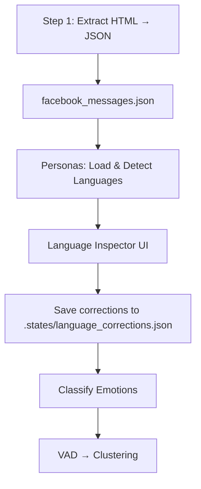
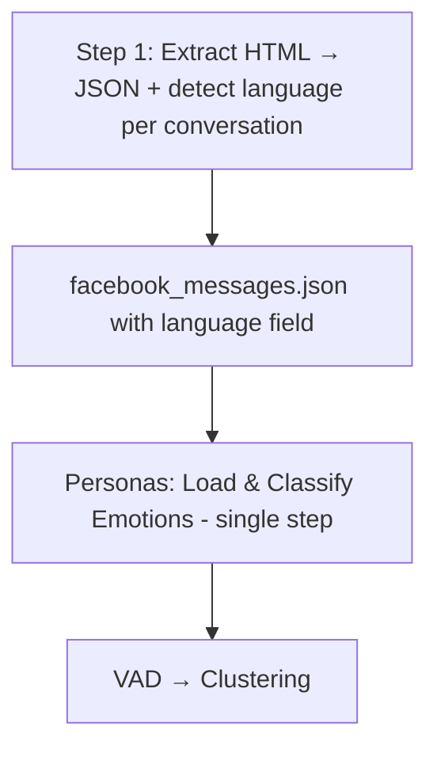
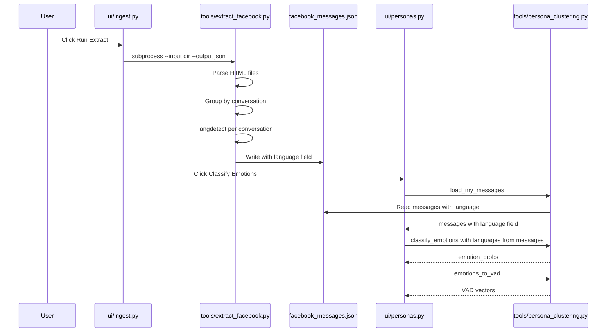

# Move Language Detection to Extraction Step

## Goal

Move conversation-level language detection from the Personas pipeline into the Facebook extraction step (Step 1 on the Vector page). Each message in `facebook_messages.json` will carry a `"language"` field (`"en"` or `"fr"`), eliminating the need for a separate detection phase and the language inspector UI in the Personas page.

## Current Architecture



**Current JSON structure:**
```json
{
  "date": "2011-03-01T20:16:16",
  "sender_name": "Romain Wllptr",
  "source": "facebook",
  "text": "hi dear...",
  "conversation": "elliemaifroggatt_10155660950233687"
}
```

## Target Architecture



**Target JSON structure:**
```json
{
  "date": "2011-03-01T20:16:16",
  "sender_name": "Romain Wllptr",
  "source": "facebook",
  "text": "hi dear...",
  "conversation": "elliemaifroggatt_10155660950233687",
  "language": "en"
}
```

## Files Modified

### 1. `tools/extract_facebook.py` — Add language detection during extraction

#### `extract_all_messages()` (lines 210-258)
- After collecting all messages and sorting by date, **group by conversation**
- For each conversation, sample up to 10 of the longest messages
- Run `langdetect.detect()` on each sample, majority-vote → `"en"` or `"fr"`
- Add `"language"` field to every message in that conversation
- Print language detection progress and summary stats

#### New helper: `detect_conversation_language()`
- Takes a list of message texts for one conversation
- Samples up to N longest texts, runs langdetect, returns majority vote
- Handles `LangDetectException` gracefully (defaults to `"en"`)

#### `main()` (lines 261-345)
- Add `argparse` with `--input` and `--output` flags (the ingest UI already passes these but the script ignores them)
- Keep backward compatibility with hardcoded defaults when no args provided

### 2. `tools/persona_clustering.py` — Remove language detection & correction code

#### Remove entirely:
- `detect_conversation_languages()` (lines 268-340) — moved to extraction
- `load_language_corrections()` (lines 834-851) — no longer needed
- `save_language_corrections()` (lines 854-868) — no longer needed
- `_LANG_CORRECTIONS_FILE` constant (line 831) — no longer needed
- Section comment `# ── Language correction persistence ───` (line 829)

#### Update `load_my_messages()` (lines 151-206):
- Preserve the `"language"` field from JSON when building the filtered message dicts
- Currently line 204 does `{**m, "text": cleaned}` which already spreads all keys including `language` — **no change needed** as long as the JSON has the field
- Update docstring to mention the `language` field in the return type

#### Update module docstring (lines 1-19):
- Remove step 2 "Detect language (EN/FR) per message" — now comes from JSON
- Update pipeline description to reflect that language is pre-detected

### 3. `ui/personas.py` — Remove language inspector, simplify pipeline

#### Remove entirely:
- `_render_language_inspector()` (lines 691-887) — ~200 lines of language correction UI
- `_run_load_and_detect()` (lines 471-552) — phase 1 load+detect function
- `_has_languages()` (lines 459-460) — helper for two-phase flow

#### Replace `_run_classify_emotions()` with unified `_run_classify()`:
- Merge load + classify into a single function
- Read `language` directly from each message dict (set during extraction)
- Derive per-message `languages` list from `m["language"]` instead of detecting
- Keep language filtering via excluded_langs checkboxes
- Keep lang_stats computation for the emotion stats display

#### Simplify button flow in `render_personas_page()`:
- Remove the two-button layout (Load & Detect / Classify Emotions)
- Restore single button: "🧠 Classify Emotions" (or "🔄 Re-classify")
- Remove the language inspector rendering block
- Remove the intermediate info messages about language detection

#### Clean up session_state keys no longer used:
- `persona_messages_raw` — was for pre-classification raw messages
- `persona_languages_raw` — was for pre-classification languages
- `persona_conv_lang_map` — was for conversation→language mapping
- `pending_lang_corrections` — was for unsaved language edits

#### Update `_run_embed()` (lines 651-688):
- Remove cleanup of language-related session_state keys that no longer exist

#### Update module docstring (lines 1-16):
- Remove step 1b about language inspector
- Simplify step description

### 4. Files NOT modified
- `ui/ingest.py` — No changes needed; it already calls `extract_facebook.py` as subprocess
- `config.py` — No changes needed
- `requirements.txt` — `langdetect` is already a dependency

## Data Flow After Refactor



## Risks & Mitigations

| Risk | Mitigation |
|------|-----------|
| Existing JSON has no `language` field | `load_my_messages()` defaults to `"en"` if field missing; user must re-run extraction |
| Language detection slows extraction | Only ~1-2 min for ~2K conversations; runs once, not on every Personas visit |
| Lost ability to manually correct languages | Acceptable trade-off — auto-detection is accurate enough for clustering purposes |
| `main()` argparse breaks backward compat | Use `argparse` with defaults matching current hardcoded values |
