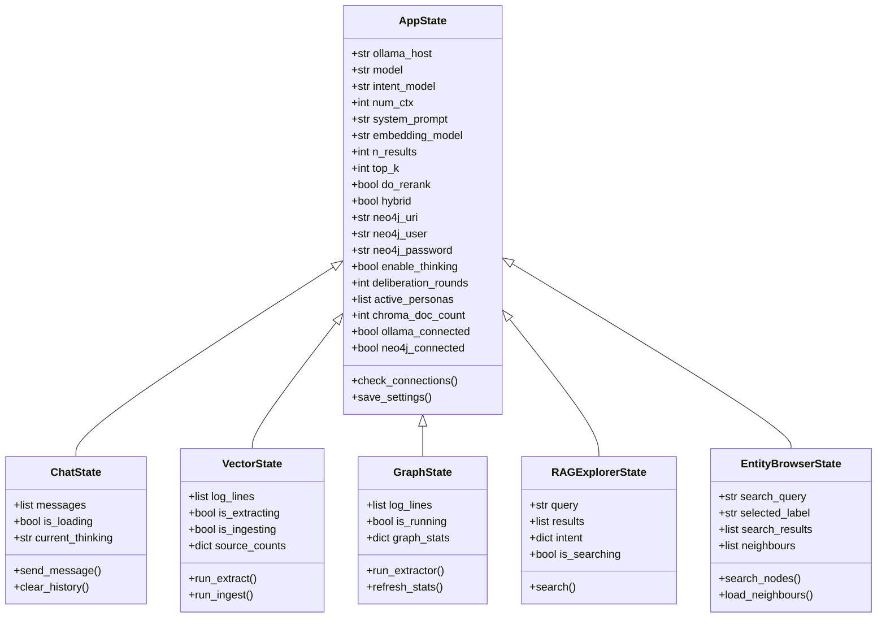

# Virtual Me — Streamlit → Reflex Migration Plan

## 1. Overview

Migrate the entire Virtual Me application from **Streamlit** to **Reflex** (Python-native full-stack framework). The backend integrations (Neo4j, ChromaDB, Ollama) remain unchanged — only the UI layer and state management are replaced.

### Why Reflex?
- Full React-based frontend with Python-only development
- True component-based architecture (vs Streamlit's top-to-bottom rerun model)
- Real-time WebSocket state sync (no full-page reruns)
- Better control over layout, routing, and styling
- Background tasks for long-running operations (subprocess streaming)

---

## 2. Current Architecture

```
app.py                    ← Streamlit entry point
config.py                 ← Constants, SOURCES registry (framework-agnostic)
├── rag/
│   ├── resources.py      ← @st.cache_resource loaders (COUPLED to Streamlit)
│   ├── retrieval.py      ← Hybrid search pipeline (light st import)
│   ├── llm.py            ← Ollama LLM calls (framework-agnostic)
│   └── graph_retrieval.py← Neo4j fact lookup (framework-agnostic)
├── graph/
│   ├── neo4j_client.py   ← Neo4j driver wrapper (framework-agnostic)
│   └── constants.py      ← Schema constants (framework-agnostic)
├── ui/                   ← Streamlit render functions (ALL COUPLED)
│   ├── sidebar.py
│   ├── settings.py
│   ├── dashboard.py
│   ├── chat.py
│   ├── ingest.py
│   ├── graph.py
│   ├── rag_explorer.py
│   └── entity_browser.py
├── pages/                ← Streamlit page wrappers (ALL COUPLED)
│   ├── dashboard.py
│   ├── chat.py
│   ├── rag_explorer.py
│   ├── ingest.py
│   ├── graph.py
│   └── entity_browser.py
└── tools/                ← CLI scripts (framework-agnostic)
    ├── ingest_facebook_messages.py
    └── extractors/*.py
```

### Streamlit Coupling Points

| Module | Coupling | Migration Effort |
|--------|----------|-----------------|
| `config.py` | None | Keep as-is |
| `rag/llm.py` | None | Keep as-is |
| `rag/graph_retrieval.py` | None | Keep as-is |
| `graph/neo4j_client.py` | None | Keep as-is |
| `graph/constants.py` | None | Keep as-is |
| `tools/*` | None | Keep as-is |
| `rag/resources.py` | `@st.cache_resource`, `st.session_state`, `st.warning` | Replace with `functools.lru_cache` or module-level singletons |
| `rag/retrieval.py` | `import streamlit as st` for `load_bm25_corpus` | Remove st import, pass dependencies |
| `ui/*` | Fully coupled | Rewrite as Reflex components |
| `pages/*` | Fully coupled | Replace with Reflex routes |
| `app.py` | Fully coupled | Replace with Reflex app entry |

---

## 3. Target Architecture

```
rxconfig.py                    ← Reflex configuration
virtual_me/                    ← Reflex app package
├── __init__.py
├── virtual_me.py              ← App entry point, routing
├── config.py                  ← Symlink or import from root config.py
├── state/                     ← Reflex State classes
│   ├── __init__.py
│   ├── app_state.py           ← Global state: connections, settings
│   ├── settings_state.py      ← Settings modal state
│   ├── chat_state.py          ← Chat messages, streaming
│   ├── dashboard_state.py     ← Dashboard data
│   ├── vector_state.py        ← Vector Store ingest state
│   ├── graph_state.py         ← Graph extractor state
│   ├── rag_explorer_state.py  ← RAG Explorer state
│   └── entity_browser_state.py
├── components/                ← Reusable Reflex components
│   ├── __init__.py
│   ├── layout.py              ← Sidebar + navbar + page wrapper
│   ├── status_badge.py        ← Connection status indicators
│   ├── scrollable_log.py      ← Log viewer component
│   ├── token_bar.py           ← Token usage progress bar
│   └── rag_card.py            ← RAG result card
├── pages/                     ← Reflex page components
│   ├── __init__.py
│   ├── dashboard.py
│   ├── chat.py
│   ├── vector.py
│   ├── graph.py
│   ├── rag_explorer.py
│   └── entity_browser.py
├── services/                  ← Backend services (decoupled from UI)
│   ├── __init__.py
│   ├── chroma_service.py      ← ChromaDB connection + caching
│   ├── embedding_service.py   ← Embedding model management
│   ├── ollama_service.py      ← Ollama client wrapper
│   └── neo4j_service.py       ← Neo4j connection wrapper
rag/                           ← Keep existing (decoupled)
│   ├── retrieval.py
│   ├── llm.py
│   └── graph_retrieval.py
graph/                         ← Keep existing (already decoupled)
│   ├── neo4j_client.py
│   └── constants.py
tools/                         ← Keep existing (CLI scripts)
config.py                      ← Keep existing
```

---

## 4. State Management Design

In Reflex, all reactive state lives in `rx.State` subclasses. Here is the mapping from Streamlit `session_state` to Reflex State:



### Key Differences from Streamlit

| Streamlit Pattern | Reflex Equivalent |
|---|---|
| `st.session_state[key]` | `self.key` in State class |
| `@st.cache_resource` | Module-level singleton or `@functools.lru_cache` |
| `st.spinner` | `rx.cond(State.is_loading, rx.spinner)` |
| `st.chat_input` / `st.chat_message` | Custom chat component with `rx.input` + `rx.box` |
| `st.dialog` | `rx.dialog.root` / `rx.drawer` |
| `st.navigation` / `st.Page` | `app.add_page` with URL routing |
| `st.columns` | `rx.hstack` / `rx.grid` |
| `st.expander` | `rx.accordion` |
| `st.metric` | Custom `rx.stat` or `rx.box` with styling |
| `st.plotly_chart` | `rx.plotly` |
| `st.dataframe` | `rx.data_table` |
| `st.markdown(unsafe_allow_html)` | `rx.el.div` with `dangerously_set_inner_html` |
| Subprocess with live log | `rx.background` task + yield state updates |

---

## 5. Subprocess Log Streaming Strategy

Both the Vector Store and Graph pages run external Python scripts via `subprocess.Popen` with live log streaming. In Streamlit this was done with a polling loop updating `st.empty()`. In Reflex:

1. Use `@rx.background` decorator on the event handler
2. Run `subprocess.Popen` with `stdout=PIPE, stderr=STDOUT`
3. Read lines in a loop, appending to `self.log_lines`
4. Call `async with self` to push state updates to the frontend
5. Frontend renders `log_lines` in a scrollable `rx.box` with monospace font

```python
class VectorState(AppState):
    log_lines: list[str] = []
    is_ingesting: bool = False

    @rx.background
    async def run_ingest(self):
        async with self:
            self.is_ingesting = True
            self.log_lines = []

        proc = subprocess.Popen(
            [sys.executable, -u, script],
            stdout=subprocess.PIPE, stderr=subprocess.STDOUT,
            text=True
        )
        for line in proc.stdout:
            async with self:
                self.log_lines.append(line.rstrip)

        async with self:
            self.is_ingesting = False
```

---

## 6. Page-by-Page Migration Notes

### 6.1 Dashboard
- **Metrics row**: `rx.stat` or custom `rx.box` components
- **Source cards**: `rx.grid` with styled `rx.card` components
- **Memory timeline chart**: `rx.recharts.bar_chart` or `rx.plotly`
- **Interest radar chart**: `rx.plotly` with Plotly `go.Scatterpolar`
- **Graph stats table**: `rx.data_table`
- **Data state**: Loaded in `DashboardState.on_load` event handler

### 6.2 Chat
- **Message list**: `rx.foreach(ChatState.messages, render_message)`
- **Chat input**: `rx.input` with `on_submit` → `ChatState.send_message`
- **Streaming**: Use `@rx.background` for LLM call, yield partial updates
- **Thinking block**: `rx.accordion` with styled inner block
- **Intent/Facts expander**: `rx.accordion.item`
- **Deliberation committee**: `rx.accordion` with status updates via background task
- **Token bar**: Custom `rx.progress` component

### 6.3 Vector Store (Semantic Memory)
- **Connection banner**: Conditional `rx.box` with status styling
- **Source count cards**: `rx.grid` with `rx.foreach`
- **Step 1 — Extract**: `rx.accordion` with file uploader + run button
- **Step 2 — Ingest**: `rx.accordion` with conversation stats + run button
- **Log streaming**: `@rx.background` subprocess handler
- **Scrollable log**: `rx.box` with `overflow_y=auto`, monospace font

### 6.4 Graph / Node Extract (Episodic Memory)
- **Connection banner**: Same pattern as Vector
- **Graph stats**: `rx.grid` with entity/relationship counts
- **Platform tabs**: `rx.tabs` with `rx.foreach(PLATFORMS, ...)`
- **Extractor cards**: Styled `rx.card` per extractor
- **Log streaming**: Same `@rx.background` pattern
- **Interest radar chart**: `rx.plotly`

### 6.5 RAG Explorer
- **Query input + friend filter**: `rx.hstack` with `rx.input` + `rx.select`
- **Metadata filters**: `rx.accordion` with date pickers, selects, number input
- **Results metrics**: `rx.hstack` with `rx.stat` components
- **Document cards**: `rx.accordion` with `rx.foreach`
- **RAG card styling**: Custom styled `rx.box`

### 6.6 Entity Browser
- **Entity type select + search**: `rx.hstack` with `rx.select` + `rx.input`
- **Node select**: `rx.select` populated from search results
- **Neighbours table**: `rx.data_table`

### 6.7 Settings
- **Modal → Drawer**: Use `rx.drawer` (side panel) instead of `st.dialog`
- **Navigation tabs**: `rx.tabs` for LLM / Embedding / RAG / Neo4j sections
- **Form fields**: `rx.input`, `rx.select`, `rx.slider`, `rx.switch`
- **Save button**: Event handler that updates `AppState` and clears caches
- **Identity presets**: `rx.select` with `on_change` updating system prompt

---

## 7. Services Layer (Backend Decoupling)

The key challenge is removing `@st.cache_resource` from `rag/resources.py`. Strategy:

### `services/chroma_service.py`
```python
import functools
import chromadb
from config import CHROMA_PATH, COLLECTION_NAME, EPISODIC_NAME

_client = None

def get_chroma_client():
    global _client
    if _client is None:
        _client = chromadb.PersistentClient(path=CHROMA_PATH)
    return _client

def get_collection(embedding_func):
    client = get_chroma_client()
    return client.get_or_create_collection(COLLECTION_NAME, embedding_function=embedding_func)

def invalidate():
    global _client
    _client = None
```

### `services/embedding_service.py`
```python
from sentence_transformers import SentenceTransformer

_model_cache = {}

def get_embedding_func(model_name: str):
    if model_name not in _model_cache:
        _model_cache[model_name] = LazyEmbeddingFunction(model_name)
    return _model_cache[model_name]

def invalidate(model_name: str = None):
    if model_name:
        _model_cache.pop(model_name, None)
    else:
        _model_cache.clear()
```

---

## 8. Styling Strategy

- Use Reflex's built-in Radix UI theme system
- Dark theme by default (matching current Streamlit dark mode)
- Custom CSS via `rx.el.style` or `style` prop on components
- Material Symbols icons via `rx.icon` (Lucide icons built into Reflex) or custom icon component
- Color palette from `graph/constants.py` LABEL_COLORS

---

## 9. Routing

| Current Streamlit URL | Reflex Route | Component |
|---|---|---|
| `/?page=dashboard` | `/` | `dashboard_page` |
| `/?page=chat` | `/chat` | `chat_page` |
| `/?page=vector` | `/vector` | `vector_page` |
| `/?page=graph` | `/graph` | `graph_page` |
| `/?page=rag` | `/rag` | `rag_explorer_page` |
| `/?page=browser` | `/browser` | `entity_browser_page` |

---

## 10. Migration Execution Order

The migration should be done in phases to maintain a working application at each step:

### Phase 1: Foundation
1. Create `reflex-refactor` branch
2. Initialize Reflex project (`reflex init`)
3. Create `services/` layer (decouple from Streamlit caching)
4. Create `AppState` with all settings
5. Create layout component (sidebar + nav)

### Phase 2: Simple Pages First
6. Dashboard page (read-only, no interactivity beyond load)
7. Entity Browser page (simple search + table)
8. Settings drawer (form inputs + save)

### Phase 3: Complex Interactive Pages
9. RAG Explorer (search + results display)
10. Chat page (streaming, deliberation, thinking blocks)

### Phase 4: Subprocess Pages
11. Vector Store page (subprocess log streaming)
12. Graph/Node Extract page (subprocess log streaming)

### Phase 5: Polish
13. Update requirements.txt
14. End-to-end testing
15. Clean up old Streamlit files

---

## 11. Risk Assessment

| Risk | Mitigation |
|---|---|
| Reflex plotly support gaps | Fall back to `rx.html` with embedded Plotly JS |
| Background task complexity for subprocess streaming | Prototype early in Phase 1 |
| Chat streaming UX differences | Use `@rx.background` with incremental state updates |
| File upload handling differences | Reflex has `rx.upload` — test with large JSON files |
| Performance of large data tables | Use pagination in `rx.data_table` |
| Loss of Streamlit's built-in auth | Not currently used, not a concern |
