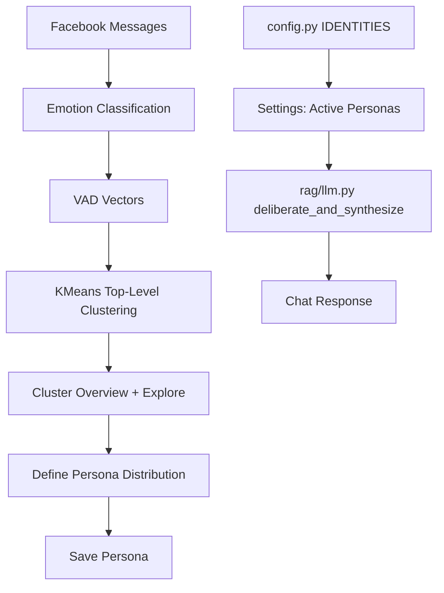
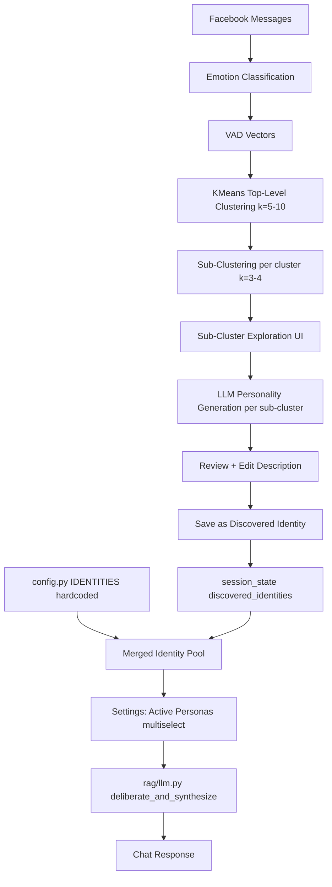
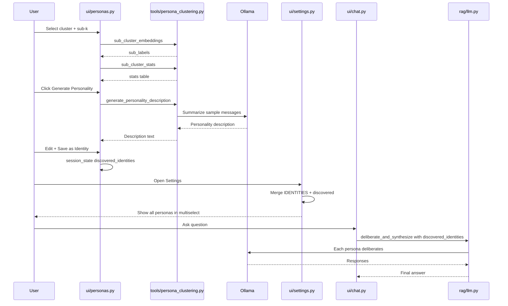

# Sub-Clustering & Personality Discovery Plan

## Goal

Run sub-clustering (k=3 or k=4) within each top-level emotional cluster to discover fine-grained personality facets. Use LLM summarization of sub-cluster sample messages to auto-generate personality descriptions that augment the hardcoded `IDENTITIES` in `config.py`, making them available in the deliberation committee.

## Current Architecture



**Problem:** The top-level clusters (k=5–10) group messages by broad emotional tone, but each cluster contains a mix of personality facets. Sub-clustering reveals the distinct "voices" within each emotional group.

**Problem:** The deliberation committee uses hardcoded IFS-style identities that are generic, not derived from the user's actual communication patterns.

## Proposed Architecture



## Implementation Details

### 1. Pipeline Functions — `tools/persona_clustering.py`

#### `sub_cluster_embeddings()`
```python
def sub_cluster_embeddings(
    embeddings: np.ndarray,
    labels: np.ndarray,
    cluster_id: int,
    sub_k: int = 3,
    random_state: int = 42,
) -> np.ndarray:
    """
    Run KMeans on the subset of embeddings belonging to cluster_id.
    
    Returns sub_labels array of same length as labels, with -1 for
    messages not in cluster_id, and 0..sub_k-1 for those in it.
    """
```

- Extracts indices where `labels == cluster_id`
- Runs KMeans with `n_clusters=sub_k` on that subset
- Returns a full-length array with `-1` for non-members

#### `sub_cluster_stats()`
```python
def sub_cluster_stats(
    sub_labels: np.ndarray,
    cluster_id: int,
    sub_k: int,
    emotion_probs: list[dict] | None = None,
) -> list[dict]:
    """
    Per-sub-cluster statistics including count, pct, and dominant emotion.
    """
```

- Similar to existing `cluster_stats()` but for sub-clusters
- If emotion data available, computes average emotion distribution per sub-cluster

#### `generate_personality_description()`
```python
def generate_personality_description(
    sample_messages: list[dict],
    cluster_name: str,
    sub_cluster_id: int,
    emotion_summary: dict | None = None,
    model: str = "qwen2.5:7b",
    ollama_host: str = "http://localhost:11434",
) -> str:
    """
    Send ~20 sample messages to Ollama and ask it to generate a
    personality description in the style of the existing IDENTITIES.
    
    Returns a personality description string.
    """
```

- Constructs a prompt with:
  - The sample messages (text only, ~20 messages)
  - The cluster name and emotion summary for context
  - Instructions to write a 2-3 sentence personality description in second person, matching the style of existing IDENTITIES
- Calls Ollama via the `ollama` library
- Returns the generated description

**Prompt template:**
```
You are analyzing a person's messaging patterns. Below are sample messages 
from a specific behavioral cluster. Based on these messages, write a 2-3 
sentence personality description in second person that captures the 
communication style, emotional tone, and behavioral patterns.

The description should follow this format:
"You are '[Name]' - [description of this personality facet]..."

Cluster context: {cluster_name}, dominant emotion: {emotion_summary}

Sample messages:
{messages}

Write ONLY the personality description, nothing else.
```

### 2. UI Changes — `ui/personas.py`

Insert a new **Step 3.5: Sub-Cluster Analysis** section between the current "Explore Cluster" (Step 3) and "Define Persona Distribution" (Step 4).

#### UI Flow:
1. **Sub-K selector** — number_input for sub_k (default 3, range 2-6)
2. **"Run Sub-Clustering" button** — runs sub-clustering on the currently selected cluster
3. **Sub-cluster overview table** — shows sub-cluster stats with emotion badges
4. **Sub-cluster sample explorer** — expandable sections showing sample messages per sub-cluster
5. **"Generate Personality" button** per sub-cluster — calls LLM to generate description
6. **Editable text area** — shows generated description, user can edit
7. **"Save as Identity" button** — saves to `session_state["discovered_identities"]`

#### Session State Keys:
- `persona_sub_labels_{cluster_id}` — sub-cluster labels for each top-level cluster
- `persona_sub_k_{cluster_id}` — sub-k used for each cluster
- `persona_sub_stats_{cluster_id}` — sub-cluster stats
- `discovered_identities` — dict of `{name: description}` for LLM-generated identities

### 3. Identity Integration

#### `config.py` — No changes to the file itself
The hardcoded `IDENTITIES` dict stays as-is. Dynamic identities are stored in `session_state["discovered_identities"]`.

#### `ui/settings.py` — Merge identity pools
Update the persona multiselect at line 138 to combine hardcoded + discovered:

```python
# Current:
_personas = [p for p in IDENTITIES.keys() if p != "The Self"]

# New:
_discovered = st.session_state.get("discovered_identities", {})
_all_identities = {**IDENTITIES, **_discovered}
_personas = [p for p in _all_identities.keys() if p != "The Self"]
```

#### `rag/llm.py` — Look up discovered identities
Update `deliberate_and_synthesize()` at line 224 to check both pools:

```python
# Current:
if persona not in IDENTITIES:
    continue
persona_sys_prompt = IDENTITIES[persona]

# New:
discovered = {}  # Will be passed as parameter or read from a shared store
all_identities = {**IDENTITIES, **discovered}
if persona not in all_identities:
    continue
persona_sys_prompt = all_identities[persona]
```

The discovered identities need to be passed through the call chain. Options:
- **Option A:** Pass `discovered_identities` as a parameter to `deliberate_and_synthesize()` from `ui/chat.py`
- **Option B:** Use a lightweight persistence file (JSON) that both the Personas page writes to and the chat reads from

**Recommendation: Both** — persist to JSON for survival across restarts, load into session_state at startup, pass through call chain at runtime.

### 4. Data Flow Diagram



### 5. JSON Persistence — `.states/discovered_identities.json`

Discovered identities will be persisted to `.states/discovered_identities.json` so they survive app restarts.

#### File format:
```json
{
  "The Empathetic Listener": {
    "description": "You are The Empathetic Listener - a warm, attentive part...",
    "source_cluster": "Cluster 2",
    "source_sub_cluster": 1,
    "created_at": "2026-02-25T18:15:00Z"
  }
}
```

#### Helper functions in `tools/persona_clustering.py`:
```python
_IDENTITIES_FILE = Path(".states/discovered_identities.json")

def load_discovered_identities() -> dict[str, dict]:
    """Load discovered identities from JSON file. Returns empty dict if not found."""

def save_discovered_identity(name, description, source_cluster, source_sub_cluster):
    """Append/update a discovered identity to the JSON file."""

def delete_discovered_identity(name: str):
    """Remove a discovered identity from the JSON file."""
```

#### Startup loading:
- `ui/personas.py` loads discovered identities into `session_state` on page render
- `ui/settings.py` and `rag/llm.py` read from `session_state`

#### `.gitignore` update:
Add `.states/` to `.gitignore` since discovered identities are personal/generated data.

## Files Modified

| File | Changes |
|------|---------|
| `tools/persona_clustering.py` | Add `sub_cluster_embeddings()`, `sub_cluster_stats()`, `generate_personality_description()`, `load_discovered_identities()`, `save_discovered_identity()`, `delete_discovered_identity()` |
| `ui/personas.py` | Add Step 3.5 sub-clustering UI, LLM generation, Save/Delete Identity, load identities on startup |
| `ui/settings.py` | Merge discovered identities into persona multiselect |
| `rag/llm.py` | Accept + use discovered identities in `deliberate_and_synthesize()` |
| `ui/chat.py` | Pass `discovered_identities` from session_state to `deliberate_and_synthesize()` |
| `.gitignore` | Add `.states/` |

## Risks & Mitigations

- **LLM quality:** Generated descriptions may be generic. Mitigation: user can edit before saving.
- **Sub-cluster size:** Very small sub-clusters with fewer than 10 messages may not produce meaningful descriptions. Mitigation: warn user, require minimum sample size.
- **Ollama availability:** LLM generation requires Ollama running. Mitigation: graceful error handling with toast notification.
- **JSON file corruption:** Concurrent writes unlikely in single-user Streamlit app. Mitigation: atomic write pattern using write-to-temp then rename.
