# Training Comparison Page — Design Plan

## Overview

A new Streamlit page for comparing LoRA fine-tuning runs side-by-side. Users paste the CLI command used to launch training and the training log output, and the page parses both to create a persistent entry. Multiple runs can then be compared via parameter tables and overlaid training curves.

## Data Model

Each training run is stored as a JSON object in `.states/training_runs.json`:

```json
{
  "runs": [
    {
      "id": "run_20260325_143000",
      "name": "Ministral-3 r32 lr1e-4",
      "created_at": "2026-03-25T14:30:00Z",
      "command": "./tools/finetune_lora.py --base-model unsloth/Ministral-3-8B-Instruct-2512-bnb-4bit ...",
      "params": {
        "base_model": "unsloth/Ministral-3-8B-Instruct-2512-bnb-4bit",
        "epochs": 2,
        "batch_size": 1,
        "grad_accum": 8,
        "lr": 0.0001,
        "max_seq_length": 1024,
        "lora_rank": 32,
        "lora_alpha": 64,
        "lora_dropout": 0.0,
        "data": "./data/facebook/finetune_data.jsonl",
        "output": "./models/my-lora",
        "use_4bit": true
      },
      "log_entries": [
        {
          "step": 10,
          "loss": 0.7359,
          "grad_norm": 0.04636,
          "learning_rate": 7.26e-05,
          "entropy": 0.7235,
          "num_tokens": 52250,
          "mean_token_accuracy": 0.8811,
          "epoch": 0.7458
        }
      ],
      "notes": "First attempt with higher rank"
    }
  ]
}
```

## CLI Command Parsing

The parser extracts parameters from the command string using `argparse`-compatible logic:

```
./tools/finetune_lora.py --base-model unsloth/Ministral-3-8B-Instruct-2512-bnb-4bit \
  --epochs 2 --batch-size 1 --grad-accum 8 --lr 1e-4 \
  --max-seq-length 1024 --lora-rank 32 --lora-alpha 64 --lora-dropout 0
```

Maps CLI flags to param keys:
- `--base-model` → `base_model`
- `--epochs` → `epochs` (int)
- `--batch-size` → `batch_size` (int)
- `--grad-accum` → `grad_accum` (int)
- `--lr` → `lr` (float)
- `--max-seq-length` → `max_seq_length` (int)
- `--lora-rank` → `lora_rank` (int)
- `--lora-alpha` → `lora_alpha` (int)
- `--lora-dropout` → `lora_dropout` (float)
- `--data` → `data` (str)
- `--output` → `output` (str)
- `--no-4bit` → `use_4bit: false`

## Training Log Parsing

Each log line is a Python dict-like string:

```
{'loss': '0.7359', 'grad_norm': '0.04636', 'learning_rate': '7.26e-05', 'entropy': '0.7235', 'num_tokens': '5.225e+04', 'mean_token_accuracy': '0.8811', 'epoch': '0.7458'}
```

Parser strategy:
1. Use regex to find all lines matching `{.*'loss'.*}` pattern
2. Convert single quotes to double quotes, parse as JSON
3. Cast all numeric string values to floats
4. Assign an incremental `step` number based on position (step = index * logging_steps)

## Page Layout

```mermaid
flowchart TD
    A[Training Comparison Page] --> B[Section 1: Add New Run]
    A --> C[Section 2: Runs Comparison Table]
    A --> D[Section 3: Training Curves]
    A --> E[Section 4: Optimal Stopping Analysis]

    B --> B1[Paste CLI command]
    B --> B2[Paste training logs]
    B --> B3[Optional: run name + notes]
    B --> B4[Parse and Save button]

    C --> C1[Side-by-side parameter table]
    C --> C2[Highlight differences between runs]
    C --> C3[Delete run button per row]

    D --> D1[Loss vs Epoch - all runs overlaid]
    D --> D2[Accuracy vs Epoch - all runs overlaid]
    D --> D3[Entropy vs Epoch - all runs overlaid]
    D --> D4[Learning Rate vs Step]

    E --> E1[Per-run: detect min loss point]
    E --> E2[Per-run: detect max accuracy point]
    E --> E3[Suggest optimal epoch to stop]
    E --> E4[Show overfitting indicators]
```



### Section 1 — Add New Run (Expander)

- `st.text_input` for an optional run name (auto-generated if empty)
- `st.text_area` for pasting the CLI command
- `st.text_area` for pasting training log output (multi-line)
- `st.text_area` for optional notes
- Parse button → validates, extracts params + log entries, saves to `.states/training_runs.json`
- Shows a preview of parsed params and log entry count before saving

### Section 2 — Runs Comparison Table

- `st.dataframe` showing all runs with columns:
  - Name, Base Model, Epochs, Batch Size, Effective Batch, LR, LoRA Rank, Alpha, Dropout, Max Seq Len, 4-bit, Final Loss, Final Accuracy, Best Loss, Best Accuracy
- Effective batch = batch_size × grad_accum
- Highlight cells where values differ across runs
- Checkbox column for selecting which runs to plot
- Delete button per run

### Section 3 — Training Curves (Charts)

Using `st.line_chart` or Altair for multi-series overlay:

- **Loss vs Epoch**: one line per selected run, labeled by run name
- **Mean Token Accuracy vs Epoch**: same overlay
- **Entropy vs Epoch**: same overlay
- **Learning Rate vs Step**: shows scheduler shape per run
- Toggle between X-axis: epoch vs step

### Section 4 — Optimal Stopping Analysis

For each selected run:
- Find the epoch with minimum loss → mark as "best checkpoint"
- Find the epoch with maximum accuracy → mark as "peak accuracy"
- Detect if loss starts increasing after the minimum (overfitting signal)
- Use a simple moving average (window=5) to smooth noisy curves
- Display a summary card per run:
  - "Best loss: 0.72 at epoch 1.5"
  - "Peak accuracy: 88.1% at epoch 0.75"
  - "⚠️ Overfitting detected after epoch 1.5 — consider stopping earlier"

## File Structure

```
pages/training_compare.py     — page wrapper (follows existing pattern)
ui/training_compare.py        — main UI module
.states/training_runs.json    — persistent storage for run data
```

## Implementation Notes

- Follow the existing page pattern: `pages/` wrapper calls `ui/` renderer
- Use `.states/` directory for persistence (already used by the project)
- No new dependencies needed — uses `pandas`, `streamlit`, and `json` (all already available)
- The CLI parser reuses the same `argparse` definition from `tools/finetune_lora.py` to stay in sync
- Log parsing is lenient — handles both dict-style `{'key': 'val'}` and JSON `{"key": "val"}` formats
